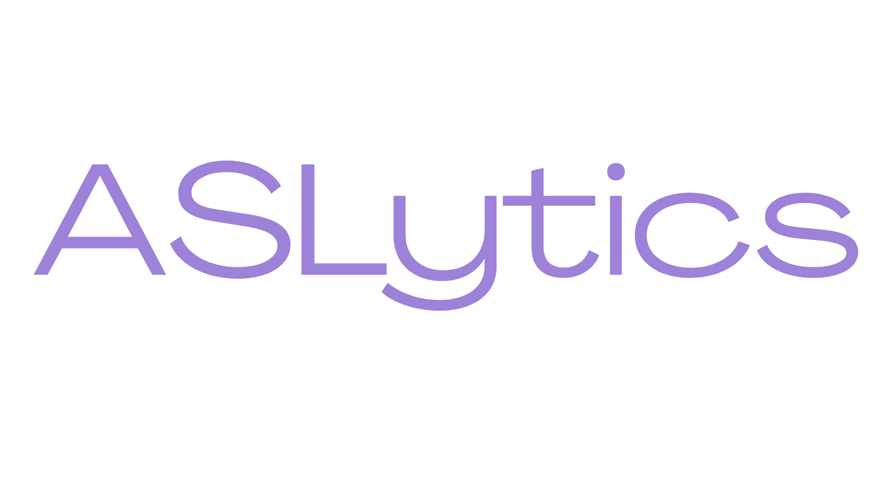
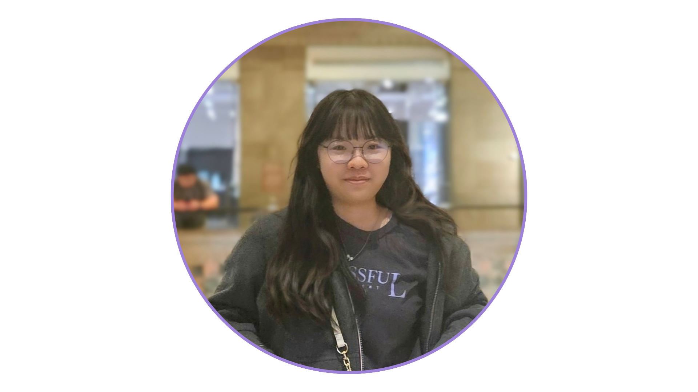
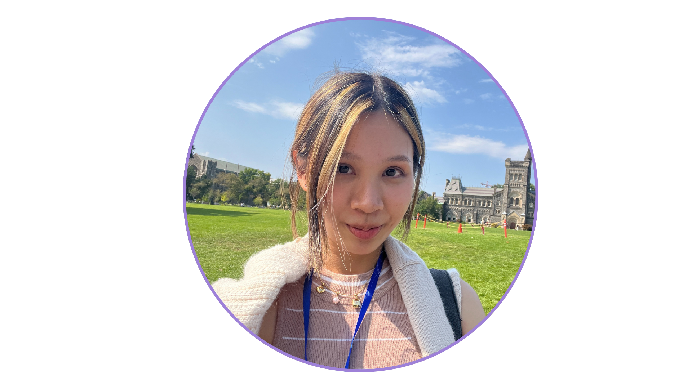
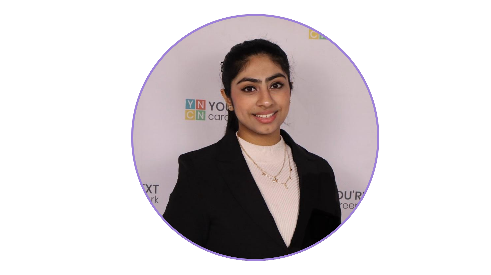
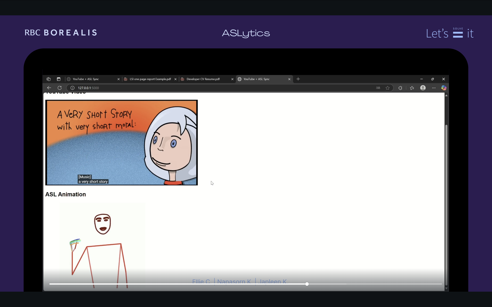

<p align="center">
  
</p>


<h1 align="center">ASLytics: Bridging the Knowledge Gap for the Deaf and Hard-of-Hearing Community</h1>
<h3 align="center">Borealis AI: Let’s Solve It! Program 2025</h3>

** Team Members:**  
- Ellie (Yi-Ting) Chang  
- Napasorn Kao-ian  
- Japleen Kaur  

**Mentors:**  
- Edwin Ng  
- Ajay Joy  

---

## ** Introduction**

### **Main Theme & Problem**  
ASLytics addresses the inaccessibility of online video content for Deaf and hard-of-hearing individuals, particularly on platforms like YouTube where sign language support is scarce. Traditional subtitles often fall short, with studies showing 84% of Deaf children struggle to keep up with caption speed (National Deaf Children's Society, 2021). As ASL is the primary language for many in the Deaf community (Mitchell & Karchmer, 2004), digital content often fails to meet their needs, creating a significant gap in access to information and entertainment.

### **What We Aim to Do**  
ASLytics is a full-stack AI-powered YouTube extension that transforms English captions into real-time ASL animations, providing the Deaf and hard-of-hearing community with equitable access to learning, information, and entertainment.

---

## **🎞️ Presentation Slides**

[Click here to view the ASLytics presentation deck)](https://www.canva.com/design/DAGlBBc3Jwc/9DMc-JfSkOijpCX8Ogvi-g/edit?utm_content=DAGlBBc3Jwc&utm_campaign=designshare&utm_medium=link2&utm_source=sharebutton)

---

## **👩‍💻 Team Members**  
|  |  |  |  
|:--------------------------:|:-------------------------------:|:-----------------------------:|  
| Ellie (Yi-Ting) Chang      | Napasorn Kao-ian                | Japleen Kaur                  |  

---

## **🗂️ Dataset**

We created a custom vocabulary dataset in pose format (joint position coordinates) by scraping over 4,400 word-level signs from ASL Signbank and Signing Savvy. Using pose estimation tools from the open-source Sign Language Processing project, we converted the videos into coordinate-based representations for real-time animation playback.  

**Acknowledgment for Dataset Sources:**  
- **ASL Signbank**  
  - In-text citation: (ASL Signbank, 2025)  
  - Full reference:  
    Hochgesang, J. A., Crasborn, O., & Lillo-Martin, D. (2025). *ASL Signbank*. [https://aslsignbank.com](https://aslsignbank.com). [https://doi.org/10.6084/m9.figshare.9741788](https://doi.org/10.6084/m9.figshare.9741788)  

- **Signing Savvy**  
  - [Signing Savvy](https://www.signingsavvy.com/)  

---

## **🙏 Acknowledgements**

### **Gloss-to-Pose Repository**

We gratefully acknowledge the **Sign Language Processing** open-source toolkit used for gloss-to-pose conversion. Please consider citing the repository if you use this toolkit in your work:

```bibtex
@misc{moryossef2021pose-format, 
    title={pose-format: Library for viewing, augmenting, and handling .pose files},
    author={Moryossef, Amit and M\"{u}ller, Mathias and Fahrni, Rebecka},
    howpublished={\url{https://github.com/sign-language-processing/pose}},
    year={2021}
}
```
---

## **📊 Results**  

Here is an example of ASLytics in action, demonstrating real-time ASL animations synchronized with YouTube captions:  

  

---

## **⚙️ How to Use**

1. Clone this repository to your local machine.  
2. Ensure you have Python and dependencies installed.  
3. Run the frontend application using the provided instructions.  
4. Input a YouTube URL to see real-time ASL animations synchronized with captions.  

---

## **📄 License**

This project is licensed under the Creative Commons Attribution-NonCommercial-ShareAlike 4.0 International (CC BY-NC-SA 4.0).  

For commercial inquiries, please contact the team directly.  

